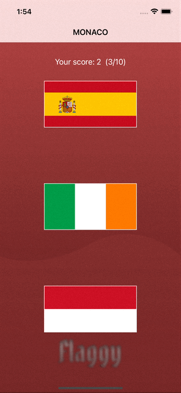
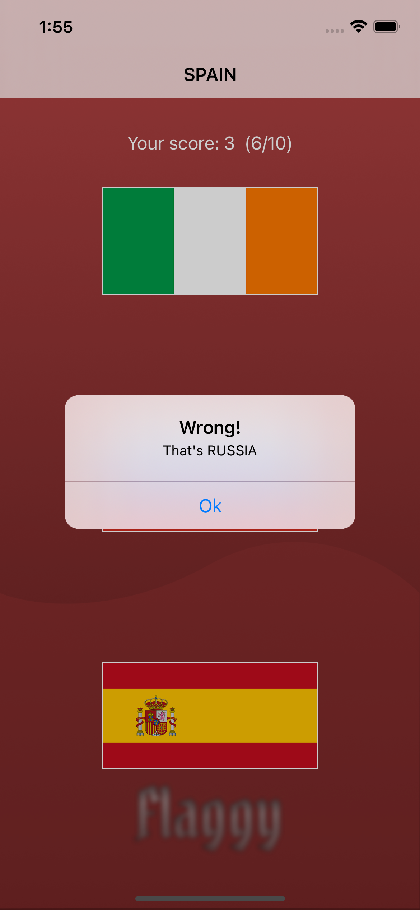

# Porjects 2: Flaggy
Hacking with swift project 2: Flaggy, with some extra feature added myself like  points animation, and wrong answer sound.

# Menu
* [Screenshots](#screenshots)
* [Source](#source)
* [Contributions](#contributions)
* [Contact](#contact)

# Sceenshot

## What's New

* UIViewPropertyAnimator
* AVAudioPlayer

# Source
Courcess: [Hacking With Swift](https://twitter.com/twostraws).

# Contributions

* All kinds of contributions (enhancements, new features, documentation & code improvements, issues & bugs reporting & todo task) are welcome. Let's make it better.

# Contact
Created by [Terry Kuo](https://twitter.com/ArgonYoYo) - feel free to contact me!
